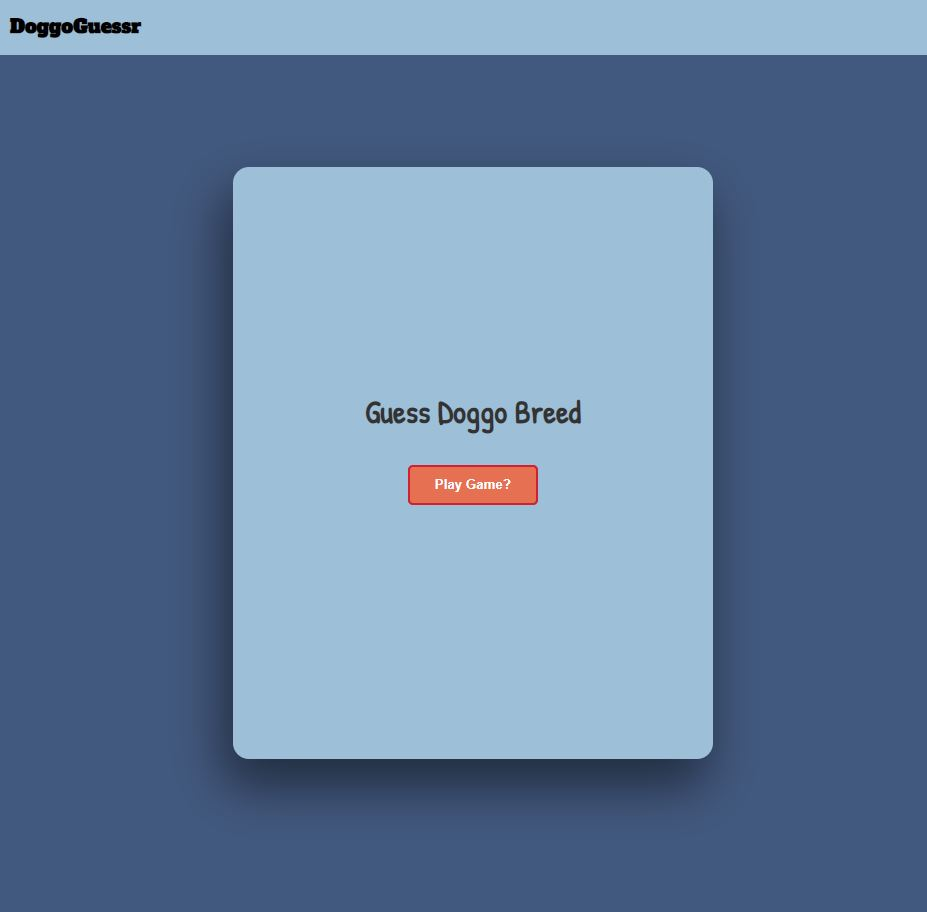
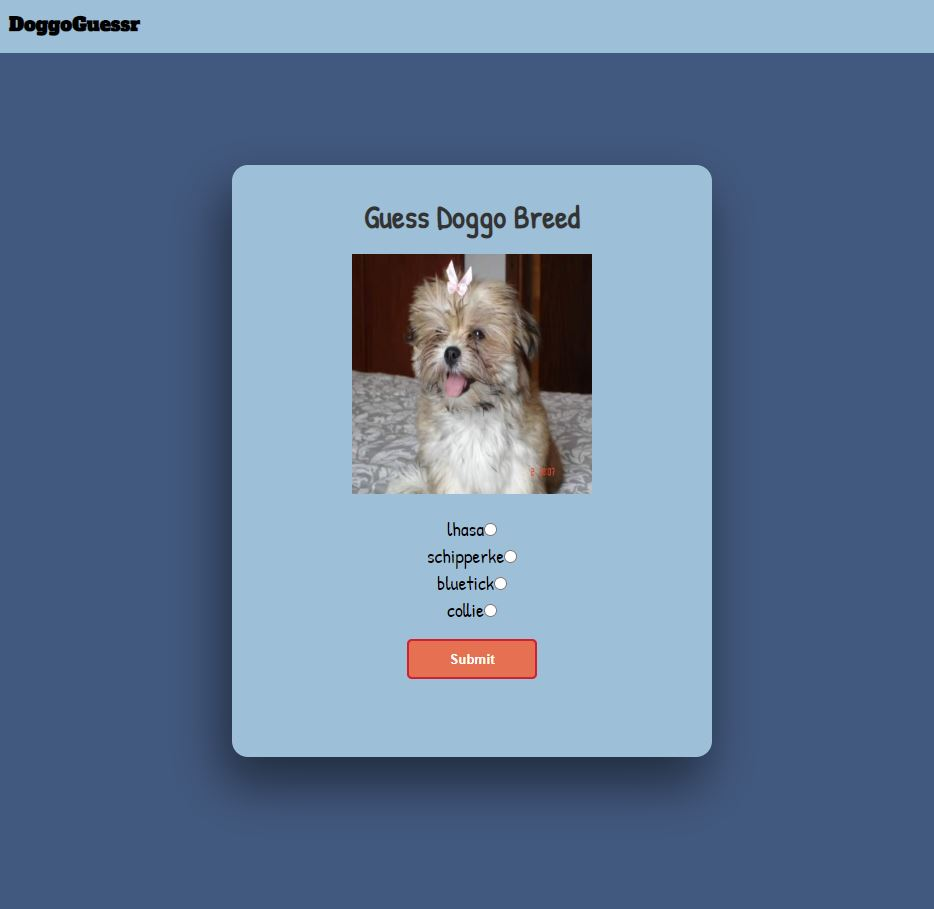
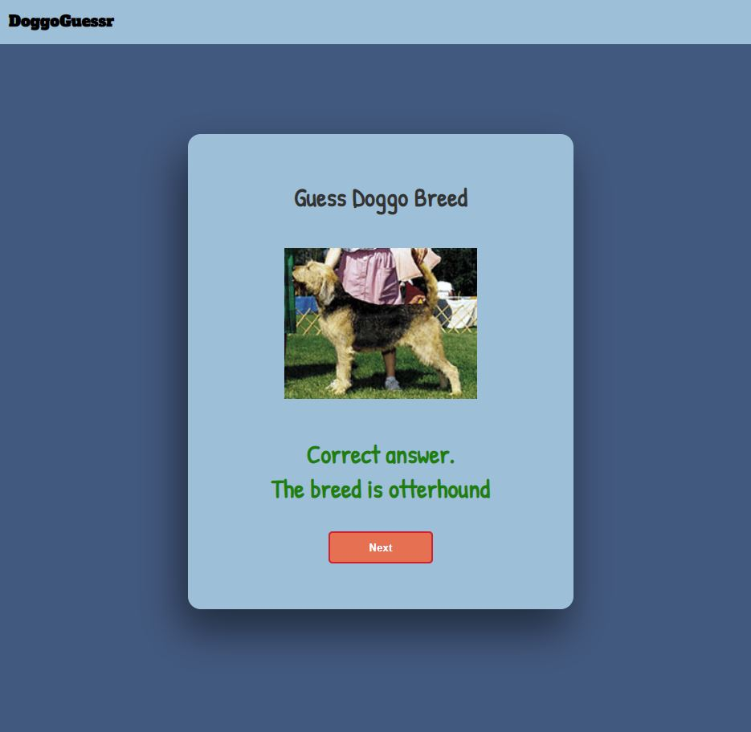
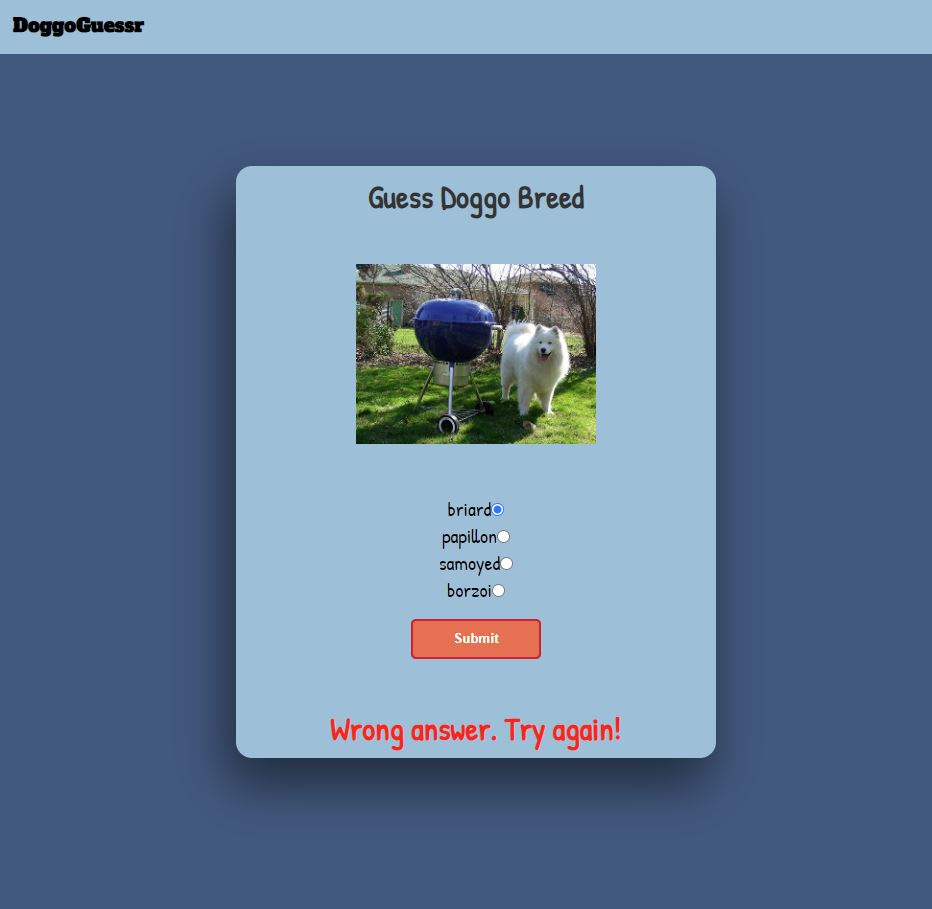

# **Doggo App**
### This was a project done in collaboration with: 
- Jigar Patel(HTML and Sass).
- Saloni Jindal(JavaScript).
- Me(JavaScript).

Doggo App is a fun game that lets you guess the breed of dogs. It tells you if you have chosen the correct answer or if your answer is wrong.

The next steps for this app are to: 
- add a score calculator to keep and display score
- to be able to select the number of rounds to play
- have multiple players

## ***Technologies***: 
### **- Front-end:**
1. HTML: mark-up language for front end development. 
2. SCSS: Superset of CSS that easily helped break down styling with BEM convetion.
3. JavaScript: scripting language to add functionality and logic.

# Project:
### - Landing Page

### - Game Card

### - Correct Answer

### - Wrong Answer

Project completed in under 24 hrs. 

Play the game! - https://doggo-guessr.netlify.app/